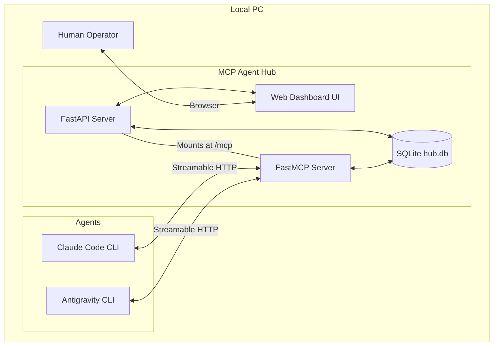

# MCP Agent Hub - Architecture

## High-Level Architecture Diagram



## Core Technologies

1. **Python 3.10+**: The runtime environment.
2. **FastAPI**: Serves the web dashboard and the `/api/state` JSON API; provides the async web framework that hosts everything.
3. **FastMCP (standalone `fastmcp` 3.x, `>=3.4,<4`)**: A Python framework for building MCP servers, exposing tools over Streamable HTTP and mounting as an ASGI app under FastAPI.
   * *Provenance / version note:* FastMCP was created by Jeremiah Lowin, not Anthropic. FastMCP 1.0 was folded into the official MCP Python SDK (`mcp.server.fastmcp`); the actively-developed line ships as the standalone `fastmcp` package, now at **3.x** (repo `PrefectHQ/fastmcp`). We depend on the standalone `fastmcp` 3.x for its first-class FastAPI mount story; the official SDK still has open friction mounting Streamable HTTP under FastAPI (see `design-decisions.md`, D13). Let `fastmcp` resolve `starlette`/`uvicorn`/`mcp` transitively — do **not** self-pin `starlette` (3.4.1 floors `starlette>=1.0.1` for CVE-2026-48710).
4. **SQLite3**: A lightweight, serverless database for local persistence, run in **WAL mode**.
5. **Jinja2 + Tailwind CSS (via CDN)**: For rendering the web dashboard without a separate Node.js/React build step.

## Component Interactions

### 1. The Hub Server (`hub.py`)
This is the single entry point. It builds the FastAPI app and the FastMCP instance and mounts the MCP ASGI app at `/mcp` (Streamable HTTP). The current FastMCP 3.x pattern:

```python
from fastmcp import FastMCP
from fastapi import FastAPI

mcp = FastMCP("MCP Agent Hub")
# ... register the 9 @mcp.tool functions and mcp.add_middleware(AgentTracker()) ...

mcp_app = mcp.http_app(path="/mcp")          # http_app(), not the old streamable_http_app()
# Combine the MCP lifespan with the hub's own startup (open WAL conn, optional reclaim backstop):
app = FastAPI(lifespan=combine_lifespans(hub_lifespan, mcp_app.lifespan))
app.mount("/mcp", mcp_app)                    # dashboard routes + /api/state live on `app`
```

> **Lifespan gotcha:** the MCP app manages its own session/task group via a lifespan. When mounting onto FastAPI you **must** wire the MCP app's lifespan into FastAPI's `lifespan` (e.g. via FastMCP's `combine_lifespans`), or tool calls fail at runtime with errors like "task group is not initialized." Bind the server to `127.0.0.1` only.

### 1a. Cross-cutting Middleware
A single FastMCP middleware (`on_call_tool` hook) centralizes concerns that would otherwise be copy-pasted into all 9 tools (see `design-decisions.md`, D14):
* **`last_seen` refresh** — read `agent_id` from the call's arguments and `touch_last_seen` on every tool call (identity comes from the arg; v1 has no auth).
* **Structured per-call logging** — emit one event row per call (tool name, args summary, timestamp, outcome) that the dashboard can surface.

This keeps the tool bodies focused on their own DB mutation. `mcp.add_middleware(...)` runs first-added first on the way in.

### 2. The Database Layer (`db.py`)
Encapsulates all SQLite interactions; called by both the FastAPI routes (to read) and the FastMCP tools (to mutate). Uses WAL mode, short-lived connections (with `check_same_thread` handled), and runs blocking calls off the event loop (via `run_in_threadpool` or `aiosqlite`) so DB I/O does not stall async handlers.
* `upsert_agent(id, skills, description)` (skills stored as JSON, D16), `get_all_agents()`, `set_agent_offline(id)`, `touch_last_seen(id)`
* `enqueue_message(...)` — sets `session_id` (minted or supplied), optional `parent_id`/`kind`, and `flagged_stale` when the recipient is stale (D6/Q8)
* `claim_pending(agent_id)` — the atomic `UPDATE ... RETURNING` claim (claims `pending` rows incl. `input_request` kind; **skips `input_required` parked rows**)
* `reclaim_stale(visibility_timeout)` — reverts unacked `in_progress` back to `pending` (never touches parked `input_required` rows)
* `request_input(message_id, question)` — parks the task as `input_required` and enqueues the child `input_request` message (D17)
* `complete_message(id, response)` — also runs the **un-park rule**: if the completed row is an `input_request`, flip its `parent_id` task from `input_required` back to `pending` and append the answer to the parent's `context` (D17)
* `fail_message(id, error)`, `get_status(message_id)` (surfaces the pending `question` when `input_required`)

### 3. Transport Layer Protocol
The server uses the **Streamable HTTP** transport (MCP `2025-03-26`+) via a single endpoint:
* `POST/GET /mcp`: agents POST JSON-RPC tool calls; the server may upgrade to an SSE stream for long-running calls (e.g. a long-polling `check_inbox`).

The legacy HTTP+SSE transport (`GET /sse` + `POST /messages`) is deprecated and intentionally not implemented. **Confirm both Claude Code and Antigravity speak Streamable HTTP** before relying on this in the test plan.

### 4. Web UI Rendering
FastAPI serves HTML templates using `Jinja2Templates`. To provide live updates without a React/WebSocket setup, the dashboard runs vanilla JavaScript that polls `/api/state` every 2 seconds and refreshes the agents table and message queue. `/api/state` caps the number of returned messages.

### 5. Liveness & Redelivery
Redelivery is **lazy-on-claim** (see `design-decisions.md`, D15): the atomic claim query itself is eligible to grab any `in_progress` row whose `claimed_at < now - VISIBILITY_TIMEOUT`, so a crashed/unacked task is recovered the moment the next consumer polls — no scheduler needed for correctness. An optional lightweight `asyncio` loop started in the lifespan runs the same reclaim `UPDATE` every ~`VISIBILITY_TIMEOUT/2` as a **backstop** for messages stranded while nobody is polling. `last_seen` is refreshed on every tool call (via the middleware, §1a); agents past `STALE_THRESHOLD` render as "stale" without blocking sends (a send to a stale agent is queued **and `flagged_stale`** for the dashboard, D6/Q8). A task parked as **`input_required`** (D17) is excluded from both the lazy claim and the reclaim sweep — it waits on its child `input_request` answer, not on a visibility timeout.

### 6. Security / Trust Model
This is a single-user, localhost developer tool with **no authentication**. The tools trust whatever `agent_id` they are given, so any local process could in principle register as another agent, drain its inbox (`check_inbox(agent_id)`), or send messages as it. The mitigation is binding to `127.0.0.1` only. Multi-user authentication is explicitly out of scope for v1 (see `design-decisions.md`, D11).

In addition to the loopback bind, the server **validates the HTTP `Origin` header** on `/mcp` (D18): requests with no `Origin` (non-browser CLI clients like Claude Code / Antigravity) pass, but a request carrying a non-localhost `Origin` is rejected. This is the MCP spec's mandated DNS-rebinding defense — it stops a malicious web page in the user's browser from POSTing to `http://localhost:8000/mcp`. It complements, and does not replace, the `127.0.0.1` bind. Implement as a small ASGI/Starlette middleware on the mounted app (or via FastMCP's middleware), allowing an `Origin` allowlist of `http://localhost[:port]` / `http://127.0.0.1[:port]`.
