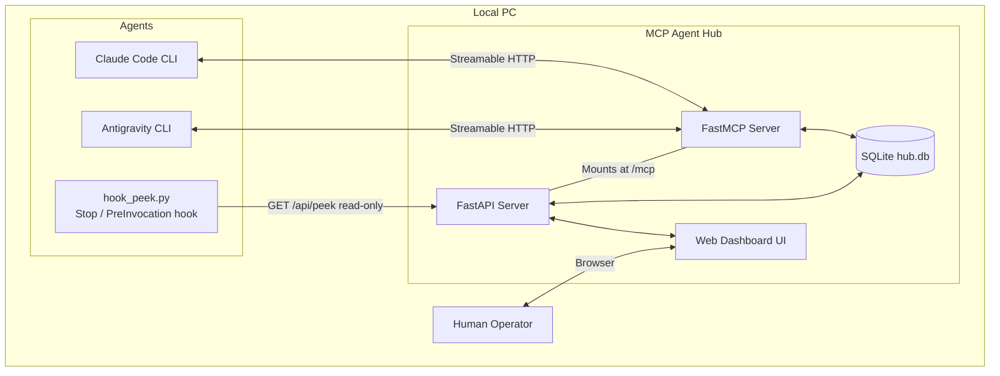

# MCP Agent Hub - Architecture

## High-Level Architecture Diagram



## Core Technologies

1. **Python 3.10+**: The runtime environment.
2. **FastAPI**: Serves the web dashboard and the `/api/state` JSON API; provides the async web framework that hosts everything.
3. **FastMCP (standalone `fastmcp` 3.x, `>=3.4,<4`)**: A Python framework for building MCP servers, exposing tools over Streamable HTTP and mounting as an ASGI app under FastAPI.
   * *Provenance / version note:* FastMCP was created by Jeremiah Lowin, not Anthropic. FastMCP 1.0 was folded into the official MCP Python SDK (`mcp.server.fastmcp`); the actively-developed line ships as the standalone `fastmcp` package, now at **3.x** (repo `PrefectHQ/fastmcp`). We depend on the standalone `fastmcp` 3.x for its first-class FastAPI mount story; the official SDK still has open friction mounting Streamable HTTP under FastAPI (see `design-decisions.md`, D13). Let `fastmcp` resolve `starlette`/`uvicorn`/`mcp` transitively — do **not** self-pin `starlette` (3.4.1 floors `starlette>=1.0.1` for CVE-2026-48710).
4. **SQLite3**: A lightweight, serverless database for local persistence, run in **WAL mode**.
5. **Jinja2 + Tailwind CSS (via CDN)**: For rendering the web dashboard without a separate Node.js/React build step.

## Component Interactions

> **Layout note (D27):** application code lives in the **`mcp_hub/`** package — `mcp_hub/hub.py`, `mcp_hub/db.py`, `mcp_hub/templates/`. `run_hub.py` (the supervisor — §7) and `hook_peek.py` stay at repo root. The server is started with `python run_hub.py` (= `uvicorn mcp_hub.hub:app`). Module-internal imports are relative (`from . import db`); `templates/` is resolved module-relative (`Path(__file__).parent / "templates"`).

### 1. The Hub Server (`mcp_hub/hub.py`)
This is the single entry point. It builds the FastAPI app and the FastMCP instance and mounts the MCP ASGI app at `/mcp` (Streamable HTTP). The current FastMCP 3.x pattern:

```python
from fastmcp import FastMCP
from fastapi import FastAPI

mcp = FastMCP("MCP Agent Hub")
# ... register the 9 @mcp.tool functions and mcp.add_middleware(AgentTracker()) ...

mcp_app = mcp.http_app(path="/mcp")          # http_app(), not the old streamable_http_app()
# Combine the MCP lifespan with the hub's own startup (open WAL conn, optional reclaim backstop):
app = FastAPI(lifespan=combine_lifespans(hub_lifespan, mcp_app.lifespan))
app.mount("/mcp", mcp_app)                    # dashboard routes + /api/state live on `app`
```

> **Lifespan gotcha:** the MCP app manages its own session/task group via a lifespan. When mounting onto FastAPI you **must** wire the MCP app's lifespan into FastAPI's `lifespan` (e.g. via FastMCP's `combine_lifespans`), or tool calls fail at runtime with errors like "task group is not initialized." Bind the server to `127.0.0.1` only.

### 1a. Cross-cutting Middleware
A single FastMCP middleware (`on_call_tool` hook) centralizes concerns that would otherwise be copy-pasted into all 9 tools (see `design-decisions.md`, D14):
* **`last_seen` refresh** — read the **direct actor arg where present** — `agent_id` (`register`/`check_inbox`/`disconnect`) or `sender_id` (`send_message`) — and `touch_last_seen`; the `message_id`-only tools (`reply`/`fail`/`request_input`/`check_status`) and `list_agents` are **not** refreshed (they're called moments after a fresh claim, or carry no caller identity) — `design-decisions.md`, D23. v1 has no auth.
* **Structured per-call logging** — append one event to an **in-memory ring buffer** (last ~200: tool name, args summary, timestamp, outcome, agent-if-known) that the dashboard's Activity panel reads via `/api/state` (D22); also emit it to stdout as a structured log.

This keeps the tool bodies focused on their own DB mutation. `mcp.add_middleware(...)` runs first-added first on the way in.

### 1b. Hook Peek/Nudge Layer (`hook_peek.py` + `/api/peek`)
An **optional, client-side** layer that makes pull-based delivery feel push-like without weakening the queue (see `design-decisions.md`, D19):
* The hub exposes a plain read-only endpoint **`GET /api/peek?agent_id=…`** on the FastAPI app (not an MCP tool), backed by `db.peek_inbox()`. It returns `{ count, senders: [...] }` mirroring what `check_inbox` would claim — but **mutates nothing** (no claim, no status change).
* A shipped **`hook_peek.py`** (stdlib-only — `urllib`, no extra deps) is wired into each client's hooks: Claude Code `Stop` / `UserPromptSubmit` / `SessionStart` (in `~/.claude/settings.json`); Antigravity `agy` `StopHook` / `PreInvocationHook` (in `hooks.json`, gated by `json-hooks-enabled`). On its trigger it peeks and, when `count > 0`, prints a nudge to stdout that the client injects into the agent's context.
* Because the hook only **peeks**, the authoritative delivery + ack path (`check_inbox` → `reply_to_message` / `fail_message`, at-least-once) is unchanged. The `Stop` / `AfkStop` variant is the most useful — it keeps an agent looping on pending work instead of going idle. *(agy's hook system was verified directly from the `agy.exe` binary — D19.)*

### 2. The Database Layer (`db.py`)
Encapsulates all SQLite interactions; called by both the FastAPI routes (to read) and the FastMCP tools (to mutate). Uses WAL mode, short-lived connections (with `check_same_thread` handled), and runs blocking calls off the event loop via **`aiosqlite`** (D21) so DB I/O does not stall async handlers — and so the long-poll never holds a threadpool worker.
* `upsert_agent(id, skills, description)` (skills stored as JSON, D16), `get_all_agents()`, `set_agent_offline(id)`, `touch_last_seen(id)`
* `enqueue_message(...)` — sets `session_id` (minted or supplied), optional `parent_id`/`kind`, and `flagged_stale` when the recipient is stale (D6/Q8)
* `claim_pending(agent_id)` — the atomic `UPDATE ... RETURNING` claim (claims `pending` rows incl. `input_request` kind; **skips `input_required` parked rows**; a `kind='result'` row is delivered and marked `completed` in the same claim — no ack, D20)
* `reclaim_stale(visibility_timeout)` — reverts unacked `in_progress` back to `pending` (never touches parked `input_required` rows)
* `peek_inbox(agent_id)` — **read-only** count + sender summary of what `claim_pending` *would* return (incl. `result` notifications; backs the `/api/peek` hook endpoint, D19); claims/mutates nothing
* `expire_messages(message_ttl)` — sweeps `pending` rows of **`kind='task'`** older than the TTL to the terminal `expired` state (D6/Q3/D24); never touches `input_request`/`result` derived messages or parked `input_required`
* `request_input(message_id, question)` — parks the task as `input_required` and enqueues the child `input_request` message (D17)
* `complete_message(id, response)` — marks `completed`, then runs two fan-out rules: the **un-park rule** — if the completed row is an `input_request`, flip its `parent_id` task from `input_required` back to `pending` and append the answer to the parent's `context` (D17); and the **result fan-out** — if the completed row is a `task`, enqueue a `kind='result'` message (carrying `response`) to its `sender_id`'s inbox, threaded by `session_id`/`parent_id` (D20)
* `fail_message(id, error)`, `get_status(message_id)` (surfaces the pending `question` when `input_required`)

### 3. Transport Layer Protocol
The server uses the **Streamable HTTP** transport (MCP `2025-03-26`+) via a single endpoint:
* `POST/GET /mcp`: agents POST JSON-RPC tool calls; the server may upgrade to an SSE stream for long-running calls (e.g. a long-polling `check_inbox`).

The legacy HTTP+SSE transport (`GET /sse` + `POST /messages`) is deprecated and intentionally not implemented. **Confirm both Claude Code and Antigravity speak Streamable HTTP** before relying on this in the test plan.

### 4. Web UI Rendering
FastAPI serves HTML templates using `Jinja2Templates`. To provide live updates without a React/WebSocket setup, the dashboard runs vanilla JavaScript that polls `/api/state` every 2 seconds and refreshes the agents table, the message queue, and an **Activity panel** fed by an in-memory ring buffer of recent tool calls (D22). `/api/state` caps the number of returned messages and also returns the recent activity events + header stats (uptime, total messages). The template is generated with the **`frontend-design`** skill (Tailwind-CDN + vanilla JS, no build step). All agent-controlled fields are passed through an `escapeHtml()` helper before `innerHTML` (stored-XSS defense — see §6 / D18), and the page carries a `Content-Security-Policy` meta.

The header also carries two **operator recovery controls** (D26, §7): an amber **Reset** and a red **Restart** button, each gated by a custom in-page confirm dialog (not `window.confirm`); Restart shows an overlay that polls for the server to go down and come back before reloading.

### 5. Liveness & Redelivery
Redelivery is **lazy-on-claim** (see `design-decisions.md`, D15): the atomic claim query itself is eligible to grab any `in_progress` row whose `claimed_at < now - VISIBILITY_TIMEOUT`, so a crashed/unacked task is recovered the moment the next consumer polls — no scheduler needed for correctness. An optional lightweight `asyncio` loop started in the lifespan runs the same reclaim `UPDATE` every ~`VISIBILITY_TIMEOUT/2` as a **backstop** for messages stranded while nobody is polling. `last_seen` is refreshed by the middleware on calls that carry a direct actor arg (§1a, D23); agents past `STALE_THRESHOLD` render as "stale" without blocking sends (a send to a stale agent is queued **and `flagged_stale`** for the dashboard, D6/Q8). A task parked as **`input_required`** (D17) is excluded from both the lazy claim and the reclaim sweep — it waits on its child `input_request` answer, not on a visibility timeout. The same optional backstop loop also runs `expire_messages(MESSAGE_TTL)` — sweeping `pending` rows of `kind='task'` older than the TTL to the terminal **`expired`** state (D6/Q3/D24); `input_request`/`result` derived messages and parked `input_required` tasks are excluded from this sweep. The long-poll itself is an **async poll loop** (D21): `check_inbox(wait=true)` re-runs the claim every `LONGPOLL_INTERVAL` between `asyncio.sleep`s (via `aiosqlite`, off the event loop) until a message appears or `timeout` elapses — never a blocking threadpool hold, which would starve the pool under concurrent waiters.

### 6. Security / Trust Model
This is a single-user, localhost developer tool with **no authentication**. The tools trust whatever `agent_id` they are given, so any local process could in principle register as another agent, drain its inbox (`check_inbox(agent_id)`), or send messages as it. The mitigation is binding to `127.0.0.1` only. Likewise there is **no ownership check** on `reply_to_message`/`fail_message`/`request_input` — any caller can ack or park any `message_id` (a direct, accepted consequence of the no-auth model; real enforcement arrives only with auth in v2). Multi-user authentication is explicitly out of scope for v1 (see `design-decisions.md`, D11).

In addition to the loopback bind, the server **validates the HTTP `Origin` header** on `/mcp` (D18): requests with no `Origin` (non-browser CLI clients like Claude Code / Antigravity) pass, but a request carrying a non-localhost `Origin` is rejected. This is the MCP spec's mandated DNS-rebinding defense — it stops a malicious web page in the user's browser from POSTing to `http://localhost:8000/mcp`. It complements, and does not replace, the `127.0.0.1` bind. Implemented as the `OriginValidationMiddleware` ASGI middleware. **As hardened 2026-06-18 (D18 note):** the middleware covers `/mcp` **and** `/api/*`, does an **exact `urlparse` host check** (not a substring), validates the **`Host`** header too (DNS-rebinding / CVE-2026-48710), and — because browsers omit `Origin` on same-origin GETs — falls back to **`Sec-Fetch-Site`** for missing-`Origin` requests (allow `same-origin`/`none`, block `cross-site`). The dashboard's own stored-XSS defense (`escapeHtml` + CSP, §4) rounds out the browser-facing hardening.

### 7. Process Supervision & Operator Recovery (`run_hub.py`, D26)
The hub is normally launched via the **`run_hub.py` supervisor** rather than `uvicorn` directly. The supervisor `Popen`s `uvicorn mcp_hub.hub:app`, redirects its output into `logs/hub.log`, and waits: if the child exits with the sentinel code **42** it relaunches; on any other exit code the supervisor stops. This is what makes the dashboard's hard Restart possible without a terminal, and an external supervisor + exit-code-42 was chosen over an in-process `os.execv` for Windows reliability.

Two unauthenticated (operator-only, localhost) POST endpoints on the FastAPI app back the dashboard controls:
* **`POST /api/reset` (soft Reset)** → clears the in-memory activity ring buffer and calls `db.reset_stuck()`, which reverts any `in_progress` messages to `pending`. Non-destructive to durable data — at-least-once (D3) already tolerates the redelivery. Returns the counts cleared/reclaimed.
* **`POST /api/restart` (hard Restart)** → schedules `os._exit(RESTART_EXIT_CODE)` shortly after the response flushes, so the supervisor relaunches a clean process (fresh DB connection + MCP lifespan).

Both endpoints sit behind the same `OriginValidationMiddleware` (§6), so a cross-site page or a rebinding attempt cannot trigger a Reset/Restart.
