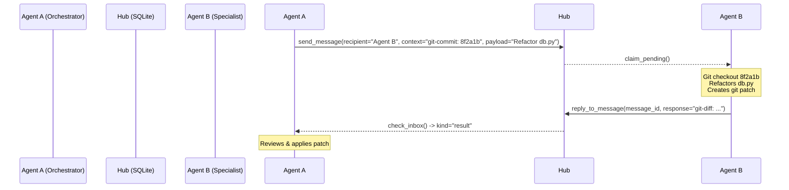
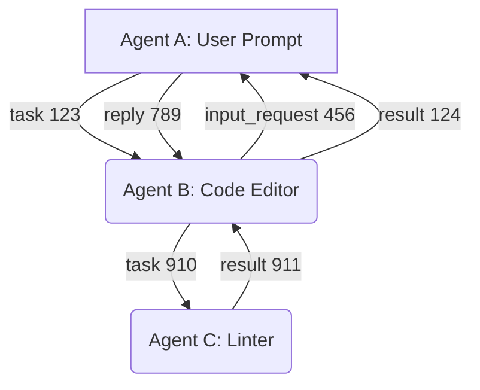

# Leveraging Multi-Agent Frameworks for MCP Agent Hub

We can draw key design concepts from existing multi-agent frameworks and standards to evolve the **MCP Agent Hub** from a basic local message broker into a robust multi-agent coding coordination platform.

Here is an analysis of how we can leverage the concepts of **A2A**, **LangGraph**, **AgentHub**, and **ACP** in our local architecture.

---

## 1. Git-DAG Workspace Sharing (Inspired by Karpathy's AgentHub)
**Concept:** 
In Karpathy's AgentHub, independent coding agents coordinate by committing work to a Git DAG and sharing code states. 

**How we can leverage it in MCP Agent Hub:**
Since our agents (e.g., Claude Code, Antigravity) operate on the same local workspace, we can make task collaboration **Git-native** by attaching workspace state metadata in messages:

* **Task Payload Diffs:** When Agent A delegates a coding task to Agent B, the `context` parameter can carry the current Git commit hash or a branch name.
* **Result Diffs:** When Agent B completes the task, instead of returning free-form text, the response can contain a **Git diff/patch** in the result message.
* **Git-Safe Workspaces:** The recipient agent can apply the diff in a temporary branch, run its tests, and reply with the final patch or test status.

---

## 2. Visual Dependency Graphs (Inspired by LangGraph)
**Concept:**
LangGraph models agent workflows as stateful directed graphs, enabling loop detection and execution tracing.

**How we can leverage it in MCP Agent Hub:**
We currently group messages by `session_id` and trace origins via `parent_id`. We can leverage this hierarchy to render a **live execution graph** directly on the human dashboard:

* **Live Mermaid Diagrams:** Generate dynamically compiled Mermaid graphs on the dashboard representing how a high-level task spawned clarification requests (`input_request`) and specialist subtasks (`task`).
* **Visual Loop Warnings:** If the message sequence forms a cycle (e.g., Agent A tasks Agent B, which tasks Agent C, which tasks Agent A), the dashboard can highlight the loop in red and alert the human operator.

---

## 3. Standardized Agent Cards (Inspired by the A2A Protocol)
**Concept:**
The Linux Foundation's A2A protocol relies on a standardized `agent-card.json` manifest listing agent descriptions, endpoints, and cryptographic keys.

**How we can leverage it in MCP Agent Hub:**
In our v1 backend, we implemented **D16 (Structured capability descriptor)** to register `skills[]`. We can align this closer to the A2A standard:

* **Well-Known Endpoint:** Expose a standardized endpoint on our local hub, e.g., `/api/agents/{agent_id}/card`, which converts our internal SQLite `skills` schema into a fully compliant A2A `agent-card.json` output.
* **Auto-Discovery:** Provide a tool for agents to retrieve these cards natively to dynamically route tasks based on skill matching, tags, and formatting rules.

---

## 4. Structured Tool Permission Delegation (Inspired by ACP)
**Concept:**
Zed's ACP implements a `session/request_permission` routine to check with the parent editor before executing tool calls.

**How we can leverage it in MCP Agent Hub:**
Currently, our `request_input` parks a task to ask the user a text question. We can leverage the permission request paradigm in our message payload structure:

* **Permission Payload Type:** Support a `kind="permission_request"` message where Agent B (handling a delegated task) asks Agent A (the initiator/operator wrapper) to approve a dangerous operation (e.g., executing a command or writing to a file outside the workspace).
* **Operator Consent:** The initiating agent can pause, ask the human operator via its terminal, and reply to unpark the task with `approved: true/false`.

---

## Proposed Action Plan for v2

1. **Git-Native Task Helpers:** Create a workspace script utility that wraps `git diff` and packages task payloads with current git commit refs.
2. **Dashboard Visual Tracer:** Add a Mermaid.js rendering engine in the `index.html` dashboard to display session message threads as interactive trees rather than linear lists.
3. **A2A Card API:** Upgrade the `/api/state` and database models to generate and serve spec-compliant `agent-card.json` schemas for discovered peers.
